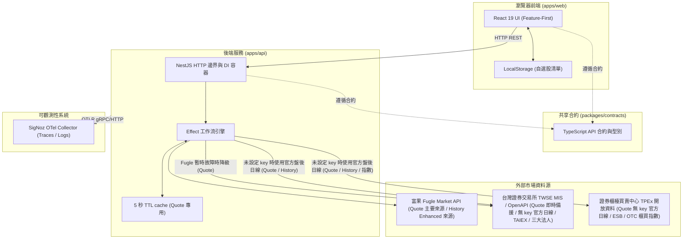
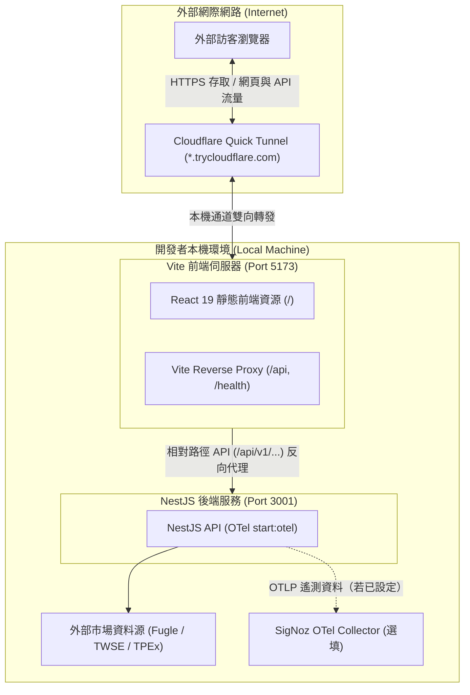

# Taiwan Stock Dashboard（台股市場資訊與個股技術分析儀表板）

A production-minded Taiwan stock dashboard demo built with NestJS, Effect and React.


## 功能特色

1. 市場概況（Market Overview）：支援盤中即時行情與盤後結算展示。盤中輪詢視窗（08:55～13:35）由 TWSE MIS 批次取得加權指數（TAIEX）與櫃買指數（OTC）並標註「即時行情 · HH:mm:ss」，前端 React Query 於盤中啟動每 30 秒輪詢更新；收盤或非交易時段呈現「YYYY/MM/DD 收盤」並自動停止輪詢，若即時訊號不可用則平滑降級至 TWSE / TPEx OpenAPI 盤後資訊。上市三大法人（外資、投信、自營商）買賣超金額維持每日盤後結算統計，點位與漲跌幅嚴格遵循金融慣例著色（上漲紅/下跌綠/持平）。
2. 個股報價（Stock Quote）：呈現焦點個股資訊（例如 `2330 台積電 [上市] [★ 已在觀察]`）；TWSE/TPEX 個股以相較前一交易日收盤價的漲跌呈現現價與漲跌幅，並標註交易日行情六格（開盤/最高/最低/成交量（張）/漲停價/跌停價）；ESB 個股以前一交易日均價作為漲跌比較基準，成交量以股顯示，開盤價、漲停價與跌停價顯示為「—」；頂部 Header 即時顯示資料來源（Fugle API、TWSE/TPEx OpenAPI、TWSE MIS 或 TPEx ESB，依市場與備援狀態切換）與最後報價時間戳記，採用 5 秒 in-memory TTL cache 與異常降級備援提示。
3. 技術線圖與均線（Stock History & Indicators）：TWSE/TPEX 支援當日/3D/5D（5 分鐘 K）與 1M/3M/6M/1Y（日 K），ESB 支援 1M/3M/6M/1Y 官方日均價線圖（average-basis），不提供盤中分 K；MA5/MA10/MA20/MA60 以可點選虛線圖例切換（預設僅 MA5 顯示，右軸標示最新均線數值標籤），十字游標採用台北時間呈現，成交量直方圖單位依市場與週期對應（TWSE/TPEX 5 分 K 以張、日 K 與 ESB 以股計）；附帶最近 5 個交易日歷史交易明細表格，TWSE/TPEX OHLC 欄位相對前一交易日收盤價以紅綠標示，ESB 依日均價呈現。
4. 本機自選股（Local-First Watchlist）：免登入即可將關注個股加入自選清單，資料持久化於瀏覽器 LocalStorage；首次啟動預設載入 8 檔自選股並自動聚焦第一檔，使用者主動清空自選清單後不會再次強制 re-seed，支援一鍵切換分析焦點與移除。
5. 頂部導覽與 Responsive 設計（Header & Responsive UI）：頂部 Header 提供全域股票代號搜尋輸入框、目前焦點個股的資料來源與最後更新時間；版面採左側焦點分析欄（市場概況/報價/線圖/近期交易明細）加右側自選股清單欄，行動裝置依序垂直堆疊。

## 系統架構拓撲

本專案採用 pnpm workspace monorepo 架構：

```text
apps/api            NestJS 12 後端服務（提供 REST API 與 Effect 非同步工作流）
apps/web            React 19 與 Vite 8 前端應用程式（採用 Feature-First 設計）
packages/contracts  前後端共享之型別定義與 API 合約
e2e/                Playwright 端到端驗證測試集
docs/               說明文件與系統真實畫面截圖
```

### 應用程式資料流拓撲（Application Architecture）



### 外部 Demo 分享拓撲（External Demo / Quick Tunnel Topology）

當需要將本機運行的服務分享給外部訪客試用時，系統透過 Cloudflare Quick Tunnel 搭配 Vite 原生 Reverse Proxy 實現單一公開網址轉發：



> **安全與邊界說明**：Quick Tunnel 僅供短期 Demo 分享使用；第三方 API key（`FUGLE_API_KEY`）僅保留於後端本機，外部訪客瀏覽器透過同源相對路徑（`/api` 與 `/health`）由 Vite 內建反向代理安全轉送至 NestJS，避免外部請求直連訪客本機。

## 核心設計理念：為什麼選擇 NestJS 搭配 Effect

本專案在後端架構上採取明確的職責劃分：

1. NestJS 負責平台與框架邊界：
   - 提供標準 HTTP 伺服器、控制器（Controllers）路由映射、中介軟體與依賴注入（Dependency Injection）容器。
   - 管理模組生命週期，提供清楚的進入點與清晰的模組結構。
2. Effect 負責業務邏輯與效果運算：
   - 將預期失敗建模於 typed error channel；刻意讓 defects 保持 defects。
   - 強健性機制：精確設定 3 秒超時控制（Timeout）與並行排程（Concurrency），專案不採用任何 upstream 重試（no retry）。
   - 優雅降級備援（Fallback）：未設定 Fugle key 時，TWSE/TPEX 個股使用交易所官方盤後日線；Fugle 已設定但暫時性網路中斷或服務異常時，才切換至 TWSE MIS。ESB 個股則直接使用 TPEx ESB 專用報價資料源。

## 市場資料來源與限制說明

本專案整合台灣金融市場公開與第三方資料管道：

| 功能 | 主要資料來源 | 備援或市場專用來源 | Cache 策略 |
| :--- | :--- | :--- | :--- |
| 個股報價（Quote） | 富果 Fugle Intraday Quote + Ticker（TWSE/TPEX 盤中行情與漲跌停 ground truth） | 未設定 key：TWSE / TPEx 官方 OpenAPI 盤後日線（Public Data Mode）；Fugle 暫時性失敗：TWSE MIS；TPEx ESB（ESB 專用報價；以前一交易日均價為漲跌比較基準） | 5 秒 in-memory TTL cache |
| 歷史 K 線（History） | 富果 Fugle MarketData API（提供 5 分 K 與日 K；Enhanced Mode 預設 1D） | TWSE / TPEx 官方盤後日線（TWSE/TPEX 未設定 key 或 Fugle 暫時性失敗時降級，限日 K；Public Data Mode 預設 1M） | 官方月資料：當月 cache 5 分鐘，已結束月份 cache 24 小時；Fugle 日 K 不使用 cache |
| 興櫃歷史資料（ESB History） | TPEx 興櫃官方歷史資料（官方日均價） | 無 | 官方月資料：當月 cache 5 分鐘，已結束月份 cache 24 小時；average-basis |
| 加權指數（TAIEX） | TWSE MIS（單次批次抓取即時行情） | TWSE OpenAPI（日終盤後 EOD 資料平滑降級） | 30 秒動態輪詢，不使用 cache |
| 櫃買指數（OTC） | TWSE MIS（單次批次抓取即時行情） | TPEx OpenAPI（日終盤後 EOD 資料平滑降級） | 30 秒動態輪詢，不使用 cache |
| 三大法人買賣超 | TWSE BFI82U JSON endpoint（日終盤後 EOD 資料） | 無 | 不使用 cache |

### 重要說明

1. **公開資料模式（Public Data Mode）**：若未設定 `FUGLE_API_KEY`（或留空），系統自動啟用公開資料模式。TWSE/TPEX 個股報價改由 TWSE / TPEx 官方 OpenAPI 盤後日線提供，不依賴 TWSE MIS；ESB 個股則使用 TPEx 官方 ESB latest-statistics snapshot。官方日線沒有可靠的盤中時間戳或當前漲跌停 ground truth，因此 Header 顯示對應 OpenAPI 來源與「公開資料模式」，盤中 5 分 K 按鈕自動停用；非 ESB 個股預設進入 1M 日 K 視角，並在焦點個股頂部常駐顯示琥珀色揭露橫幅。
2. **Enhanced Mode**：設定有效之 `FUGLE_API_KEY` 時啟用，TWSE/TPEX 個股預設提供盤中 1D（5 分 K）高頻即時行情與完整走勢；ESB 仍使用 TPEx 官方日均價歷史資料。
3. TWSE／TPEx／ESB 的官方歷史資料端點主要於交易日收盤後更新當日資料；上市／上櫃顯示收盤資訊，興櫃顯示日均價。ESB 即時報價另由 TPEx ESB latest-statistics snapshot 提供。

## 安裝與快速啟動

以下兩條路都從專案根目錄執行。**有 Docker 就用 Docker；只有在沒有 Docker 或需要熱重載開發時，才準備 Node、pnpm、mise 等本機依賴。**

### 路徑 A：推薦 Docker / Production-like Demo

#### 前置需求

- Docker Desktop，或 Docker Engine + Docker Compose v2。
- 不需要在主機安裝 Node.js、pnpm、Redis 或 Nginx。
- `FUGLE_API_KEY` 選填；留空即使用 Public Data Mode。
- SigNoz / OTLP collector 選填；沒有 collector 也能啟動並使用 API。

Docker Compose 會自行提供 Node 24 API runtime、Redis 7、Nginx 靜態前端與 reverse proxy。瀏覽器只連接同源的 `/api` 與 `/health`，預設公開 host port 為 `8088`：

```bash
docker compose up --build
```

開啟：

```text
http://localhost:8088
```

Health check：

```text
http://localhost:8088/health
```

常用指令：

```bash
# 背景執行
docker compose up --build -d

# 查看服務 log
docker compose logs -f

# 停止並移除容器與 network
docker compose down

# 改用其他 host port
WEB_PORT=8090 docker compose up --build
```

Docker Compose 會在內部以 `redis://redis:6379` 連接 Redis；應用程式仍遵循 Redis fail-open 政策，Redis 故障只會停用 cache，不會改變市場資料正確性。不要把 native 模式的 `OTEL_EXPORTER_OTLP_ENDPOINT=http://localhost:4318` 直接當成 Docker 設定：容器內的 `localhost` 是 API 容器本身。Docker 沒有 collector 時保持空白；若 collector 在主機或其他網路位置，請改用容器可達的 endpoint。

`FUGLE_API_KEY` 是選填設定。留空時 Docker 仍可直接展示 TWSE/TPEX 官方盤後日線價格（Public Data Mode）；若要展示 Fugle 盤中即時行情與 5 分 K，才需要在啟動前 export 有效 key。Docker Compose 不會自動讀取 `apps/api/.env.local`；若要啟用 Enhanced Mode，請先在 host shell export，再啟動 Compose：

```bash
export FUGLE_API_KEY=your-key
docker compose up --build
```

沒有 key 時不需要額外設定；直接執行 `docker compose up --build` 即可使用 Public Data Mode。不要為了 Docker 路徑把 `.env.example` 盲目複製成含有 host-only OTLP endpoint 的根目錄 `.env`；請依上面的 Docker endpoint 說明設定，或維持空白。

### 路徑 B：Native Local Development

#### 必要依賴

- Node.js：`>=24 <25`
- pnpm：`>=11 <12`
- `mise`：只有使用 `mise run local` 或 `mise run demo` 時需要。

Redis、Nginx、SigNoz / OTLP collector 都不是 native 啟動的必要依賴：

- Redis 選填。只有需要本機 Redis-backed cache 時才啟動，並在 `apps/api/.env.local` 設定 `REDIS_URL=redis://localhost:6379`；未設定時 cache 會停用，資料正確性不受影響。
- SigNoz / OTLP collector 選填。native 模式的 `localhost` 指主機，例如 `OTEL_EXPORTER_OTLP_ENDPOINT=http://localhost:4318`；沒有 collector 時留空即可。
- Nginx 不需要安裝；native web 使用 Vite dev server。

安裝相依套件並建立 native API 設定：

```bash
pnpm install
cp .env.example apps/api/.env.local
```

`FUGLE_API_KEY` 可留空以使用 Public Data Mode，也可填入有效 key 以啟用 Enhanced Mode。

使用既有的一鍵指令：

```bash
# API + Web，不啟動 Cloudflare public tunnel
mise run local
```

或手動分開啟動：

```bash
# 終端機 1：API（http://localhost:3001）
pnpm dev:api

# 終端機 2：Web（http://localhost:5173）
pnpm dev:web
```

### 外部 Demo 分享：Native + Cloudflare Quick Tunnel

`mise run demo` 需要 `mise` 與 `cloudflared`；其中 `cloudflared` 只有外部分享時才需要：

```bash
mise run demo
```

該工作流程會先建置，再平行啟動：

1. 後端 API：`pnpm --filter @tw-stock-dashboard/api start:otel`（Port 3001）。
2. 前端 Web：`pnpm dev:web:tunnel`（Port 5173，使用同源相對路徑 API）。
3. Cloudflare Quick Tunnel：`cloudflared tunnel --url http://localhost:5173`。

終端機會在 `[demo:tunnel]` 區塊印出 `https://xxxx.trycloudflare.com` 臨時公開網址。Quick Tunnel 適合短期展示，不是正式 HA 部署；正式環境應另行設定 Named Tunnel、Access 或自訂網域。

### 建置與品質驗證指令

本專案設有全套自動化檢驗管道，提交前皆須通過所有關卡：

| 指令 | 說明 |
| :--- | :--- |
| `pnpm build` | 編譯所有套件與前端靜態資源 |
| `pnpm lint` | 執行 ESLint 靜態程式碼檢查與架構邊界檢查 |
| `pnpm typecheck` | 嚴格型別檢查（包含 contracts, api 與 web） |
| `pnpm test` | 執行單元測試與整合測試（Vitest） |
| `pnpm test:e2e` | 執行 Playwright 端到端驗證測試集 |
| `pnpm smoke:dev-topology` | 執行前後端真實拓撲（5173 呼叫 3001）即時煙霧測試（選填，需設定 API Key） |
| `pnpm verify:boundaries` | 驗證模組架構邊界防護規則 |
| `pnpm dev:web:tunnel` | 啟動前端相對路徑 Tunnel 模式（供 Cloudflare 反向代理使用） |
| `mise run demo` | 一鍵建置並平行啟動後端（含 OTel）、前端與 Cloudflare Tunnel |

## 版本管理與 Release

本專案使用 Changesets 3 管理 monorepo 內各 workspace package 的獨立 Semantic Version。
一般 feature / fix branch 只提交程式碼、測試與 `.changeset/*.md`；真正的 `package.json` 版本更新會集中在 `Version Packages PR`，確認 release 後才由 `dev` merge 到 `main`。

```mermaid
flowchart LR
  FEATURE(["feature/* / fix/*"])
  FEATURE_PR{{"Feature PR"}}
  DEV(["dev<br/>整合中"])
  VERSION_PR{{"Version Packages PR"}}
  READY(["dev<br/>release-ready"])
  RELEASE_PR{{"Release PR"}}
  MAIN(["main"])
  TAG_WF[["Release Tags Workflow"]]
  TAGS["Package Git Tags"]

  FEATURE -->|"開 PR"| FEATURE_PR
  FEATURE_PR -->|"merge"| DEV
  DEV -->|"自動建立 / 更新"| VERSION_PR
  VERSION_PR -->|"merge"| READY
  READY -->|"開 PR"| RELEASE_PR
  RELEASE_PR -->|"merge"| MAIN
  MAIN --> TAG_WF
  TAG_WF --> TAGS

  classDef branch fill:#e8f1ff,stroke:#2563eb,stroke-width:2px,color:#172554
  classDef pr fill:#f3e8ff,stroke:#9333ea,stroke-width:2px,color:#581c87
  classDef workflow fill:#fff7d6,stroke:#ca8a04,stroke-width:2px,color:#713f12
  classDef output fill:#eaf7ee,stroke:#16a34a,stroke-width:2px,color:#14532d

  class FEATURE,DEV,READY,MAIN branch
  class FEATURE_PR,VERSION_PR,RELEASE_PR pr
  class TAG_WF workflow
  class TAGS output
```



圖中藍色圓角節點是 Git branch，紫色六角形是 Pull Request，黃色雙框是 GitHub workflow，綠色節點是 release output。
完整的 Changesets、一般 release、production hotfix 與 package dependency bump 流程請看 [`docs/versioning-and-releases.md`](docs/versioning-and-releases.md)；第一次啟用 GitHub automation 前，另請完成 [`docs/versioning-github-setup.md`](docs/versioning-github-setup.md) 的一次性設定。

## 可觀測性（Observability，選填）

後端內建 OpenTelemetry zero-code auto-instrumentation，支援將追蹤資料（Traces）與結構化日誌（Logs）匯出至 SigNoz。

### 啟動 Telemetry

設定環境變數後透過專用指令啟動：

```bash
export OTEL_EXPORTER_OTLP_ENDPOINT="http://<your-signoz-host>:4318"
export OTEL_EXPORTER_OTLP_PROTOCOL="http/protobuf"
export OTEL_SERVICE_NAME="tw-stock-dashboard-api"
export OTEL_DEPLOYMENT_ENV="development"

pnpm --filter @tw-stock-dashboard/api start:otel
```

### 追蹤關聯與資安政策

1. 關聯追蹤（Correlation）：每個傳入的 HTTP 請求均由中介軟體自動分配唯一的 `request_id`，並與 OpenTelemetry `trace_id` 緊密關聯，輸出於每筆 JSON 日誌中。
2. 機密遮罩（Redaction Policy）：日誌系統嚴格過濾機密資訊，`FUGLE_API_KEY`、授權標頭及連線憑證絕不輸出至終端機或傳送至遠端收集器。
3. 外部 Demo 遙測覆蓋：執行 `mise run demo` 時，後端同樣以 `start:otel` 啟動；若已設定可用的 OTEL exporter / SigNoz collector，外部訪客透過 Cloudflare Tunnel 觸發的 API 操作同樣會產生並匯出 OpenTelemetry Traces 與結構化日誌。

## 架構決策與邊界防護（Architecture Invariants）

1. Feature-First 前端分層：嚴格遵循 `shared → entities → features → widgets → app` 單向依賴方向。禁止同層功能相互引用，禁止底層模組獲知業務領域知識。
2. 跨應用零共享（Zero Cross-App Imports）：`apps/api` 與 `apps/web` 不得直接互相引用程式碼，所有資料結構與通訊合約均收斂於 `packages/contracts`。
3. ESLint 邊界自動化驗證：透過 `eslint-plugin-boundaries` 與獨立邊界驗證腳本於 CI/CD 流程強制阻擋違規引用。
4. 本機優先（Local-First）：使用者自選股清單完全儲存於本機瀏覽器端，具備零伺服器延遲、即時更新與隱私安全特性。
5. 記憶體 cache 策略（In-Memory Caching）：個股即時報價採用 5 秒 in-memory TTL cache；TWSE/TPEX/ESB 官方歷史月資料使用 Redis cache，當月 5 分鐘、已結束月份 24 小時，cache key 前綴為 `history:twse:*`、`history:tpex:*`、`history:esb:*`；Redis 未啟用或異常時採 fail-open，不影響正確性；市場概況不使用 cache。
6. 無資料庫與免登入（No DB / No Auth）：Demo 專注於即時行情工作流與前端視覺呈現，不增加非必要之資料庫與身分驗證／授權基礎建設負擔。
7. Demo 通道防護邊界（Demo Tunnel Boundary）：Quick Tunnel 僅作為開發與展示之臨時入口；`FUGLE_API_KEY` 嚴格限制於後端處理，永不暴露至前端。Tunnel 僅單點暴露 Vite（Port 5173），所有 API 與 health check 請求均透過同源反向代理轉發至本機 Nest API，且僅在 tunnel 模式下允許 `.trycloudflare.com` 存取。
