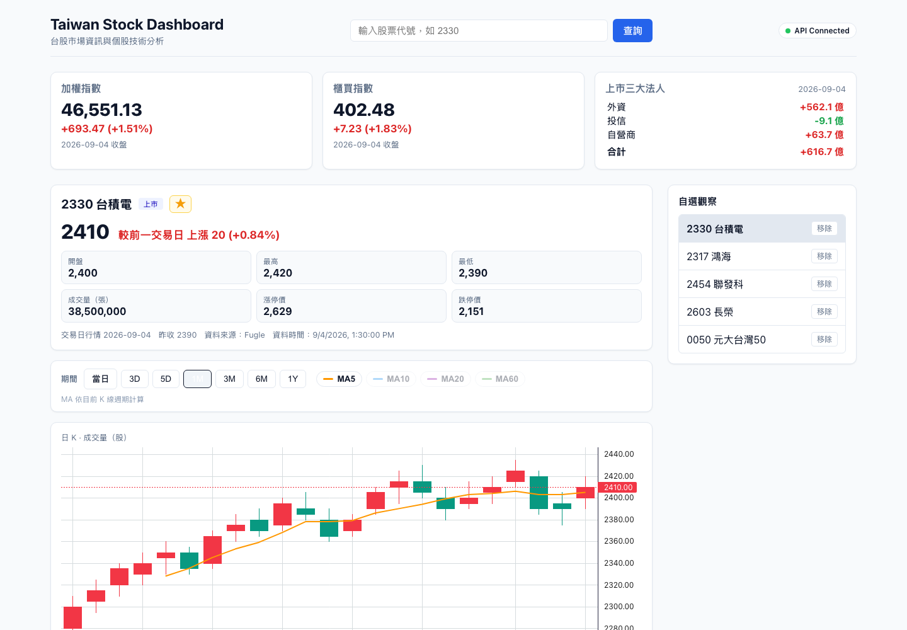
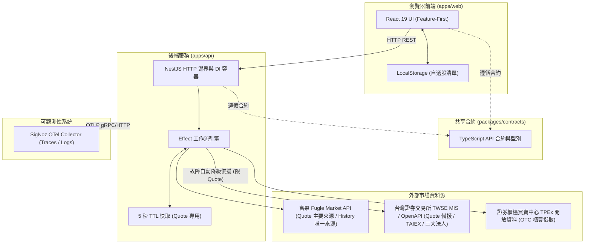

# Taiwan Stock Dashboard（台股市場資訊與個股技術分析儀表板）

A production-minded Taiwan stock dashboard demo built with NestJS, Effect and React.



## 功能特色

1. 市場概況（Market Overview）：呈現最近交易日加權指數（TAIEX）與櫃買指數（OTC）收盤資訊，以及上市三大法人（外資、投信、自營商）合計買賣超金額。
2. 個股報價（Stock Quote）：以明確文字呈現相較前一交易日的漲跌（上漲紅/下跌綠/持平），含昨收價、上市櫃 badge、交易日行情六格（開盤/最高/最低/成交量（張）/漲停價/跌停價）、資料來源與報價時間戳記，配置 5 秒 in-memory TTL 快取。
3. 技術線圖與均線（Stock History & Indicators）：支援當日/3D/5D（5 分鐘 K）與 1M/3M/6M/1Y（日 K），預設當日；MA5/MA10/MA20/MA60 以可點選圖例切換（預設僅 MA5 顯示，MA 依目前 K 線週期計算）與成交量直方圖（5 分 K 以張、日 K 以股計）。
4. 本機自選股（Local-First Watchlist）：免登入即可將關注個股加入自選清單，資料持久化於瀏覽器 LocalStorage，支援一鍵點擊切換分析與移除。
5. 狀態監控與響應設計（Health & Responsive UI）：頂部顯示 API 即時連線狀態燈號，中央為全域股票搜尋；版面採左側焦點分析欄（報價/線圖/近期交易資料）加右側自選股欄，行動裝置依序堆疊。

## 系統架構拓撲

本專案採用 pnpm workspace monorepo 架構：

```text
apps/api            NestJS 12 後端服務（提供 REST API 與 Effect 異步工作流）
apps/web            React 19 與 Vite 8 前端應用程式（採用 Feature-First 設計）
packages/contracts  前後端共享之型別定義與 API 合約
e2e/                Playwright 端到端驗證測試集
docs/               說明文件與系統真實畫面截圖
```

### 資料流與元件拓撲



## 核心設計理念：為什麼選擇 NestJS 搭配 Effect

本專案在後端架構上採取明確的職責劃分：

1. NestJS 負責平台與框架邊界：
   - 提供標準 HTTP 伺服器、控制器（Controllers）路由映射、中介軟體與依賴注入（Dependency Injection）容器。
   - 管理模組生命週期，提供清楚的進入點與清晰的模組結構。

2. Effect 負責業務邏輯與效果運算：
   - 將預期失敗建模於 typed error channel；刻意讓 defects 保持 defects。
   - 強健性機制：配置精確的 3 秒超時控制（Timeout）、並行排程（Concurrency），專案不採用任何 upstream 重試（no retry）。
   - 優雅降級備援（Fallback）：當 Fugle 遭遇暫時性網路中斷或服務異常時，自動將個股報價（Quote）平滑切換至 TWSE MIS 備援資料源。

## 市場資料來源與限制說明

本專案整合台灣金融市場公開與第三方資料管道：

| 功能項目 | 資料來源 | 降級備援機制 | 快取策略 |
| :--- | :--- | :--- | :--- |
| 個股報價（Quote） | 富果 Fugle Intraday Quote + Ticker（盤中行情與漲跌停 ground truth） | TWSE MIS（限 transient/eligible 異常，取 o/h/l/v/u/w/z/y 盤中快照） | 5 秒 in-memory TTL 快取 |
| 歷史 K 線（History） | 富果 Fugle MarketData API | 無（Fugle only，未配置金鑰回傳 500） | 不快取（無快取） |
| 加權指數（TAIEX） | TWSE OpenAPI（日終盤後 EOD 數據） | 無 | 不快取 |
| 櫃買指數（OTC） | TPEx OpenAPI（日終盤後 EOD 數據） | 無 | 不快取 |
| 三大法人買賣超 | TWSE BFI82U JSON endpoint（日終盤後 EOD 數據） | 無 | 不快取 |

### 重要說明

1. 個股分析功能（報價與歷史線圖）需要設定 `FUGLE_API_KEY`。若未設定金鑰，系統回傳 500 錯誤且不會降級備援。
2. TWSE 與 TPEx 官方公開端點主要於交易日收盤後更新當日 EOD 數據，顯示最近一個有效交易日之收盤資訊。

## 安裝與快速啟動

### 前置需求

- Node.js：受 `package.json` engines 嚴格限制，必須為 `>=24 <25`。
- pnpm：受 `package.json` engines 嚴格限制，必須為 `>=11 <12`。

### 安裝步驟

```bash
# 複製專案庫
git clone https://github.com/jchuder/tw-stock-dashboard.git
cd tw-stock-dashboard

# 安裝相依套件
pnpm install
```

### 開發伺服器啟動

API 服務支援 Node 24 原生 `--env-file-if-exists=.env.local` 載入機制。複製範本檔案建立本機環境變數配置，填入金鑰後啟動（亦可透過 shell export 設定，外部環境變數優先權高於 `.env.local`）：

```bash
# 建立後端本機環境變數檔案
cp .env.example apps/api/.env.local
# 編輯 apps/api/.env.local 填入 FUGLE_API_KEY

# 終端機 1：啟動後端 API 伺服器 (http://localhost:3001)
pnpm dev:api

# 終端機 2：啟動前端 Web 應用程式 (http://localhost:5173)
pnpm dev:web
```

可參考專案根目錄之 `.env.example` 了解各項環境變數用途。

### 建置與品質驗證指令

本專案設有全套自動化檢驗管道，提交前皆須通過所有關卡：

| 指令 | 說明 |
| :--- | :--- |
| `pnpm build` | 編譯所有套件與前端靜態資源 |
| `pnpm lint` | 執行 ESLint 靜態代碼檢查與架構邊界檢查 |
| `pnpm typecheck` | 嚴格型別檢查（包含 contracts, api 與 web） |
| `pnpm test` | 執行單元測試與整合測試（Vitest） |
| `pnpm test:e2e` | 執行 Playwright 端到端驗證測試集 |
| `pnpm smoke:dev-topology` | 執行前後端真實拓撲（5173 呼叫 3001）即時煙霧測試（選填，需配置 API Key） |
| `pnpm verify:boundaries` | 驗證模組架構邊界防護規則 |

## 可觀測性（Observability，選填）

後端內建 OpenTelemetry zero-code auto-instrumentation，支援將鏈路追蹤（Traces）與結構化日誌（Logs）導出至 SigNoz。

### 啟動 Telemetry

設定環境變數後透過專用指令啟動：

```bash
export OTEL_EXPORTER_OTLP_ENDPOINT="http://<your-signoz-host>:4318"
export OTEL_EXPORTER_OTLP_PROTOCOL="http/protobuf"
export OTEL_SERVICE_NAME="tw-stock-dashboard-api"
export OTEL_DEPLOYMENT_ENV="development"

pnpm --filter @tw-stock-dashboard/api start:otel
```

### 追蹤關聯與資安政策

1. 關聯追蹤（Correlation）：每個傳入的 HTTP 請求均由中介軟體自動分配唯一的 `request_id`，並與 OpenTelemetry `trace_id` 緊密關聯，輸出於每筆 JSON 日誌中。
2. 機密脫敏（Redaction Policy）：日誌系統嚴格過濾機密資訊，`FUGLE_API_KEY`、授權標頭及連線憑證絕不輸出至終端機或傳送至遠端收集器。

## 架構決策與邊界防護（Architecture Invariants）

1. Feature-First 前端分層：嚴格遵循 `shared → entities → features → widgets → app` 單向依賴方向。禁止同層功能相互引用，禁止底層模組獲知業務領域知識。
2. 跨應用零共享（Zero Cross-App Imports）：`apps/api` 與 `apps/web` 不得直接互相引用代碼，所有資料結構與通訊合約均收斂於 `packages/contracts`。
3. ESLint 邊界自動化驗證：透過 `eslint-plugin-boundaries` 與獨立邊界驗證腳本於 CI/CD 流程強制阻擋違規引用。
4. 本機優先（Local-First）：使用者自選股清單完全儲存於本機瀏覽器端，具備零伺服器延遲、即時更新與隱私安全特性。
5. 記憶體快取策略（In-Memory Caching）：僅為個股即時報價配置 5 秒 in-memory TTL 快取，歷史 OHLCV 與市場概況不快取。
6. 無資料庫與免登入（No DB / No Auth）：Demo 專注於即時行情工作流與前端視覺呈現，不增加非必要之資料庫與鑑權基礎建設負擔。
