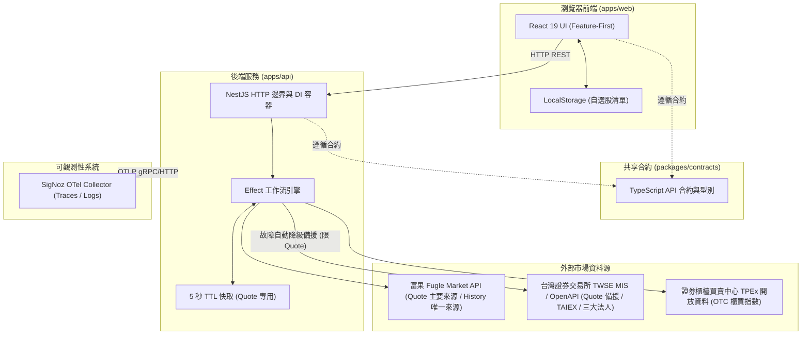
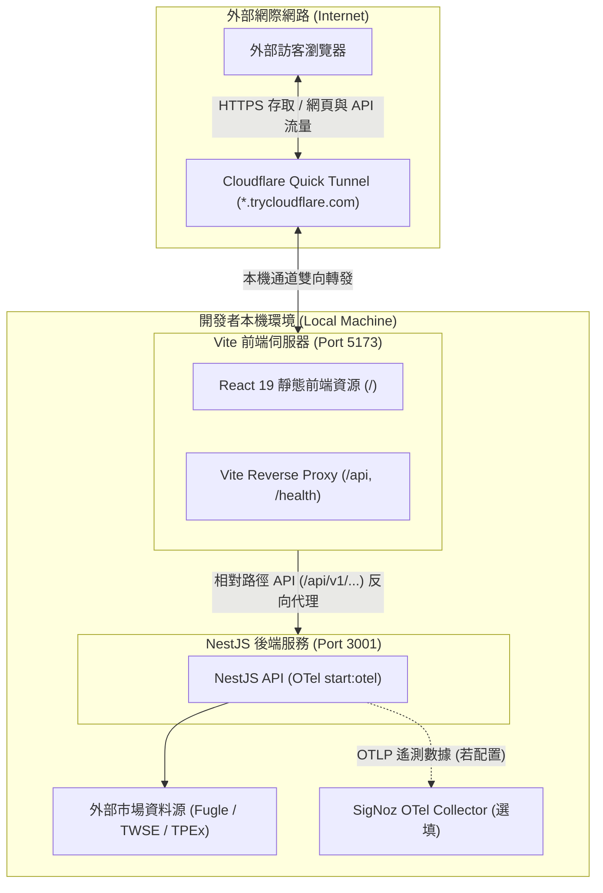

# Taiwan Stock Dashboard（台股市場資訊與個股技術分析儀表板）

A production-minded Taiwan stock dashboard demo built with NestJS, Effect and React.


## 功能特色

1. 市場概況（Market Overview）：支援盤中即時行情與盤後結算展示。盤中輪詢視窗（08:55～13:35）由 TWSE MIS 批次取得加權指數（TAIEX）與櫃買指數（OTC）並標註「即時行情 · HH:mm:ss」，前端 React Query 於盤中啟動每 30 秒輪詢更新；收盤或非交易時段呈現「YYYY/MM/DD 收盤」並自動停止輪詢，若即時訊號不可用則平滑降級至 TWSE / TPEx OpenAPI 盤後資訊。上市三大法人（外資、投信、自營商）買賣超金額維持每日盤後結算統計，點位與漲跌幅嚴格遵循金融慣例著色（上漲紅/下跌綠/持平）。
2. 個股報價（Stock Quote）：呈現焦點個股資訊（例如 `2330 台積電 [上市] [★ 已在觀察]`），以明確文字呈現相較前一交易日的漲跌（現價與漲跌幅同步以紅/綠/持平著色），標註前一交易日收盤價與交易日行情六格（開盤/最高/最低/成交量（張）/漲停價/跌停價）；頂部 Header 即時顯示資料來源（Fugle API Connected 或 TWSE MIS 備援切換）與最後報價時間戳記，配置 5 秒 in-memory TTL 快取與異常降級備援提示。
3. 技術線圖與均線（Stock History & Indicators）：支援當日/3D/5D（5 分鐘 K）與 1M/3M/6M/1Y（日 K），預設當日；MA5/MA10/MA20/MA60 以可點選虛線圖例切換（預設僅 MA5 顯示，右軸標示最新均線數值標籤），十字游標採用台北時間呈現，成交量直方圖單位自動對應（5 分 K 以張、日 K 以股計）；附帶最近 5 個交易日歷史交易明細表格，OHLC 欄位相對前一交易日收盤價以紅綠標示。
4. 本機自選股（Local-First Watchlist）：免登入即可將關注個股加入自選清單，資料持久化於瀏覽器 LocalStorage；首次啟動預設 seed 台積電（2330）並自動聚焦，使用者主動清空自選清單後不會再次強制 re-seed，支援一鍵點擊切換分析焦點與移除。
5. 頂部導航與響應設計（Header & Responsive UI）：頂部 Header 提供全域股票代號搜尋輸入框、目前焦點個股的資料來源與最後更新時間；版面採左側焦點分析欄（市場概況/報價/線圖/近期交易明細）加右側自選股清單欄，行動裝置依序垂直堆疊。

## 系統架構拓撲

本專案採用 pnpm workspace monorepo 架構：

```text
apps/api            NestJS 12 後端服務（提供 REST API 與 Effect 異步工作流）
apps/web            React 19 與 Vite 8 前端應用程式（採用 Feature-First 設計）
packages/contracts  前後端共享之型別定義與 API 合約
e2e/                Playwright 端到端驗證測試集
docs/               說明文件與系統真實畫面截圖
```

### 應用程式資料流拓撲（Application Architecture）



### 外部 Demo 分享拓撲（External Demo / Quick Tunnel Topology）

當需要將本機運行的服務分享給外部訪客試用時，系統透過 Cloudflare Quick Tunnel 搭配 Vite 原生 Reverse Proxy 實現單一公開網址轉發：



> **安全與邊界說明**：Quick Tunnel 僅供短期 Demo 分享使用；第三方 API 金鑰（`FUGLE_API_KEY`）僅保留於後端本機，外部訪客瀏覽器透過同源相對路徑（`/api` 與 `/health`）由 Vite 內建反向代理安全轉送至 NestJS，避免外部請求直連訪客本機。

## 核心設計理念：為什麼選擇 NestJS 搭配 Effect

本專案在後端架構上採取明確的職責劃分：

1. NestJS 負責平台與框架邊界：
   - 提供標準 HTTP 伺服器、控制器（Controllers）路由映射、中介軟體與依賴注入（Dependency Injection）容器。
   - 管理模組生命週期，提供清楚的進入點與清晰的模組結構。

2. Effect 負責業務邏輯與效果運算：
   - 將預期失敗建模於 typed error channel；刻意讓 defects 保持 defects。
   - 強健性機制：配置精確的 3 秒超時控制（Timeout）、並行排程（Concurrency），專案不採用任何 upstream 重試（no retry）。
   - 優雅降級備援（Fallback）：當 Fugle 遭遇暫時性網路中斷或服務異常時，自動將個股報價（Quote）平滑切換至 TWSE MIS 備援資料源。

## 市場資料來源與限制說明

本專案整合台灣金融市場公開與第三方資料管道：

| 功能項目 | 資料來源 | 降級備援機制 | 快取策略 |
| :--- | :--- | :--- | :--- |
| 個股報價（Quote） | 富果 Fugle Intraday Quote + Ticker（盤中行情與漲跌停 ground truth） | TWSE MIS（限 transient/eligible 異常，取 o/h/l/v/u/w/z/y 盤中快照） | 5 秒 in-memory TTL 快取 |
| 歷史 K 線（History） | 富果 Fugle MarketData API | 無（Fugle only，未配置金鑰回傳 500） | 不快取（無快取） |
| 加權指數（TAIEX） | TWSE MIS（單次批次抓取即時行情） | TWSE OpenAPI（日終盤後 EOD 數據平滑降級） | 30 秒動態輪詢，不快取 |
| 櫃買指數（OTC） | TWSE MIS（單次批次抓取即時行情） | TPEx OpenAPI（日終盤後 EOD 數據平滑降級） | 30 秒動態輪詢，不快取 |
| 三大法人買賣超 | TWSE BFI82U JSON endpoint（日終盤後 EOD 數據） | 無 | 不快取 |

### 重要說明

1. 個股分析功能（報價與歷史線圖）需要設定 `FUGLE_API_KEY`。若未設定金鑰，系統回傳 500 錯誤且不會降級備援。
2. TWSE 與 TPEx 官方公開端點主要於交易日收盤後更新當日 EOD 數據，顯示最近一個有效交易日之收盤資訊。

## 安裝與快速啟動

### 前置需求

- Node.js：受 `package.json` engines 嚴格限制，必須為 `>=24 <25`。
- pnpm：受 `package.json` engines 嚴格限制，必須為 `>=11 <12`。

### 安裝步驟

```bash
# 複製專案庫
git clone https://github.com/jchuder/tw-stock-dashboard.git
cd tw-stock-dashboard

# 安裝相依套件
pnpm install
```

### 開發伺服器啟動（一般本機模式）

API 服務支援 Node 24 原生 `--env-file-if-exists=.env.local` 載入機制。複製範本檔案建立本機環境變數配置，填入金鑰後啟動（亦可透過 shell export 設定，外部環境變數優先權高於 `.env.local`）：

```bash
# 建立後端本機環境變數檔案
cp .env.example apps/api/.env.local
# 編輯 apps/api/.env.local 填入 FUGLE_API_KEY

# 終端機 1：啟動後端 API 伺服器 (http://localhost:3001)
pnpm dev:api

# 終端機 2：啟動前端 Web 應用程式 (http://localhost:5173)
pnpm dev:web
```

可參考專案根目錄之 `.env.example` 了解各項環境變數用途。

### 外部 Demo 分享啟動（Cloudflare Quick Tunnel 模式）

若需產生單一臨時公開網址供外部人員試用，專案提供透過 `mise` 一鍵建置並平行啟動前後端與 Cloudflare 通道：

#### 先決條件
- [mise](https://mise.jdx.dev/)：管理執行環境與任務自動化（本機已配置）
- [cloudflared](https://developers.cloudflare.com/cloudflare-one/connections/connect-apps/install-and-setup/installation/)：`brew install cloudflared`（僅外部分享時需要）

#### 一鍵啟動指令
```bash
mise run demo
```

該工作流程會自動依序執行：
1. `pnpm build`：完成全專案建置產物。
2. 平行啟動三項服務：
   - 後端 API：`pnpm --filter @tw-stock-dashboard/api start:otel`（監聽 Port 3001，保留完整 OpenTelemetry 遙測）
   - 前端 Web：`pnpm dev:web:tunnel`（以 `VITE_API_URL=""` 監聽 Port 5173，啟用相對路徑與 tunnel allowlist）
   - Cloudflare Quick Tunnel：`cloudflared tunnel --url http://localhost:5173`
3. 終端機會在 `[demo:tunnel]` 區塊印出 `https://xxxx.trycloudflare.com` 臨時公開網址，直接提供給測試者即可。

#### 使用限制與安全性說明
- **臨時網址**：Quick Tunnel 隨機生成，每次重新啟動皆會變更。
- **短期用途**：該網址為公開 Internet 入口，僅供短期面試或同仁試用展示，不設有 SLA，且不宜長期公開張貼以保護 Fugle API 調用額度。
- **非正式部署**：本功能非正式生產環境部署；正式線上部署建議使用具名通道（Named Tunnel）、自訂網域或配置 Cloudflare Access 身份驗證。

### 建置與品質驗證指令

本專案設有全套自動化檢驗管道，提交前皆須通過所有關卡：

| 指令 | 說明 |
| :--- | :--- |
| `pnpm build` | 編譯所有套件與前端靜態資源 |
| `pnpm lint` | 執行 ESLint 靜態代碼檢查與架構邊界檢查 |
| `pnpm typecheck` | 嚴格型別檢查（包含 contracts, api 與 web） |
| `pnpm test` | 執行單元測試與整合測試（Vitest） |
| `pnpm test:e2e` | 執行 Playwright 端到端驗證測試集 |
| `pnpm smoke:dev-topology` | 執行前後端真實拓撲（5173 呼叫 3001）即時煙霧測試（選填，需配置 API Key） |
| `pnpm verify:boundaries` | 驗證模組架構邊界防護規則 |
| `pnpm dev:web:tunnel` | 啟動前端相對路徑 Tunnel 模式（供 Cloudflare 反向代理使用） |
| `mise run demo` | 一鍵建置並平行啟動後端（含 OTel）、前端與 Cloudflare Tunnel |

## 可觀測性（Observability，選填）

後端內建 OpenTelemetry zero-code auto-instrumentation，支援將鏈路追蹤（Traces）與結構化日誌（Logs）導出至 SigNoz。

### 啟動 Telemetry

設定環境變數後透過專用指令啟動：

```bash
export OTEL_EXPORTER_OTLP_ENDPOINT="http://<your-signoz-host>:4318"
export OTEL_EXPORTER_OTLP_PROTOCOL="http/protobuf"
export OTEL_SERVICE_NAME="tw-stock-dashboard-api"
export OTEL_DEPLOYMENT_ENV="development"

pnpm --filter @tw-stock-dashboard/api start:otel
```

### 追蹤關聯與資安政策

1. 關聯追蹤（Correlation）：每個傳入的 HTTP 請求均由中介軟體自動分配唯一的 `request_id`，並與 OpenTelemetry `trace_id` 緊密關聯，輸出於每筆 JSON 日誌中。
2. 機密脫敏（Redaction Policy）：日誌系統嚴格過濾機密資訊，`FUGLE_API_KEY`、授權標頭及連線憑證絕不輸出至終端機或傳送至遠端收集器。
3. 外部 Demo 遙測覆蓋：執行 `mise run demo` 時，後端同樣以 `start:otel` 啟動；若已配置可用的 OTEL exporter / SigNoz collector，外部訪客透過 Cloudflare Tunnel 觸發的 API 操作同樣會產生並匯出 OpenTelemetry Traces 與結構化日誌。

## 架構決策與邊界防護（Architecture Invariants）

1. Feature-First 前端分層：嚴格遵循 `shared → entities → features → widgets → app` 單向依賴方向。禁止同層功能相互引用，禁止底層模組獲知業務領域知識。
2. 跨應用零共享（Zero Cross-App Imports）：`apps/api` 與 `apps/web` 不得直接互相引用代碼，所有資料結構與通訊合約均收斂於 `packages/contracts`。
3. ESLint 邊界自動化驗證：透過 `eslint-plugin-boundaries` 與獨立邊界驗證腳本於 CI/CD 流程強制阻擋違規引用。
4. 本機優先（Local-First）：使用者自選股清單完全儲存於本機瀏覽器端，具備零伺服器延遲、即時更新與隱私安全特性。
5. 記憶體快取策略（In-Memory Caching）：僅為個股即時報價配置 5 秒 in-memory TTL 快取，歷史 OHLCV 與市場概況不快取。
6. 無資料庫與免登入（No DB / No Auth）：Demo 專注於即時行情工作流與前端視覺呈現，不增加非必要之資料庫與鑑權基礎建設負擔。
7. Demo 通道防護邊界（Demo Tunnel Boundary）：Quick Tunnel 僅作為開發與展示之臨時入口；`FUGLE_API_KEY` 嚴格限制於後端處理，永不暴露至前端。Tunnel 僅單點暴露 Vite（Port 5173），所有 API 與健康檢查請求均透過同源反向代理轉發至本機 Nest API，且僅在 tunnel 模式下允許 `.trycloudflare.com` 存取。
