# Taiwan Stock Dashboard（台股市場資訊與個股技術分析儀表板）

現代化台股市場與個股分析儀表板，提供台灣證券市場概況、個股即時報價、K 線與多週期均線走勢圖，以及本機自選觀察名單。


## 功能特色

1. 市場概況（Market Overview）：即時呈現加權指數（TAIEX）、櫃買指數（OTC）收盤點位與漲跌幅，以及上市三大法人（外資、投信、自營商）合計買賣超金額。
2. 個股報價（Stock Quote）：提供上市櫃個股現價、昨收價、漲跌幅、資料來源與報價時間戳記。
3. 技術線圖與均線（Stock History & Indicators）：提供 1 個月、3 個月、6 個月 K 線圖，支援 MA5、MA10、MA20、MA60 均線即時開關切換與成交量直方圖。
4. 本機自選股（Local-First Watchlist）：免登入即可將關注個股加入自選清單，資料持久化於瀏覽器 LocalStorage，支援一鍵點擊切換分析與移除。
5. 狀態監控與響應設計（Health & Responsive UI）：頂部顯示 API 即時連線狀態燈號；版面支援桌面雙欄佈局（Sidebar 與主分析區）與行動裝置單欄流暢佈局。

## 系統架構拓撲

本專案採用 pnpm workspace monorepo 架構：

```text
apps/api            NestJS 12 後端服務（提供 REST API 與 Effect 異步管線）
apps/web            React 19 與 Vite 8 前端應用程式（採用 Feature-First 設計）
packages/contracts  前後端共享之型別定義與 API 合約
e2e/                Playwright 端到端驗證測試集
docs/               說明文件與系統真實畫面截圖
```

### 資料流與元件拓撲

```mermaid
flowchart TB
    subgraph Client["瀏覽器前端 (apps/web)"]
        UI["React 19 UI (Feature-First)"]
        LocalStorage["LocalStorage (自選股清單)"]
        UI <--> LocalStorage
    end

    subgraph Contracts["共享合約 (packages/contracts)"]
        Types["TypeScript API 合約與型別"]
    end

    subgraph Server["後端服務 (apps/api)"]
        Nest["NestJS HTTP 邊界與 DI 容器"]
        EffectEngine["Effect 工作流引擎"]
        Cache["In-Memory TTL 快取"]
        Nest --> EffectEngine
        EffectEngine <--> Cache
    end

    subgraph Upstream["外部市場資料源"]
        Fugle["富果 Fugle Market API (主要來源)"]
        TWSE["台灣證券交易所 TWSE OpenAPI / MIS (備援與概況)"]
        TPEx["證券櫃檯買賣中心 TPEx 開放資料 (櫃買指數)"]
    end

    subgraph Telemetry["可觀測性系統"]
        SigNoz["SigNoz OTel Collector (Traces / Logs)"]
    end

    UI -- HTTP REST --> Nest
    UI -. 遵循合約 .-> Types
    Nest -. 遵循合約 .-> Types
    EffectEngine --> Fugle
    EffectEngine -- 故障自動降級備援 --> TWSE
    EffectEngine --> TPEx
    Server -- OTLP gRPC/HTTP --> SigNoz
```



## 核心設計理念：為什麼選擇 NestJS 搭配 Effect

本專案在後端架構上採取明確的職責劃分：

1. NestJS 負責平台與框架邊界：
   - 提供標準 HTTP 伺服器、控制器（Controllers）路由映射、中介軟體與依賴注入（Dependency Injection）容器。
   - 管理模組生命週期，提供清楚的進入點與清晰的模組結構。

2. Effect 負責業務邏輯與效果運算：
   - 異步流程與型別化錯誤處理（Typed Failures）：透過靜態型別明確界定所有可能失敗的錯誤種類，消除未捕獲異常（uncaught exceptions）。
   - 強健性機制：內建指數退避重試（Retry with Exponential Backoff）、精確超時控制（Timeout）與並行排程（Concurrency）。
   - 優雅降級備援（Fallback）：當主要資料供應商遭遇頻率限制或網路中斷時，自動平滑切換至備援資料源。

## 市場資料來源與限制說明

本專案整合多個台灣金融市場公開與第三方資料管道：

1. 個股報價與歷史 K 線：
   - 主要來源（Primary）：富果 Fugle MarketData API，提供結構化行情資料。
   - 備援來源（Fallback）：台灣證券交易所（TWSE）公開 OpenAPI 與即時行情頁面。當未設定 Fugle 金鑰或外部呼叫失敗時自動啟用。
2. 市場概況：
   - 加權指數與三大法人買賣超：取自 TWSE 官方開放資料 API。
   - 櫃買指數：取自證券櫃檯買賣中心（TPEx）官方開放資料 API。
3. EOD（日終盤後）與盤中資料特性：
   - TWSE 與 TPEx 官方公開端點主要於交易日收盤後（約 14:30 至 17:00 之間）更新當日 EOD 數據。
   - 非交易時段、週末或國定假日查詢時，系統將顯示最近一個有效交易日之收盤資訊。
   - 盤中即時報價之精確度與頻率取決於所配置的 Fugle API 方案與開盤時段。

## 安裝與快速啟動

### 前置需求

- Node.js 24.20.0 LTS 或更高版本（受 `package.json` engines 規範）。
- pnpm 11.25.0 或更高版本。

### 安裝步驟

```bash
# 複製專案庫
git clone https://github.com/jchuder/tw-stock-dashboard.git
cd tw-stock-dashboard

# 安裝相依套件
pnpm install

# 複製環境變數範本（選填）
cp .env.example apps/api/.env.local
```

### 開發伺服器啟動

開啟兩個終端機視窗分別執行後端與前端：

```bash
# 啟動後端 API 伺服器 (http://localhost:3001)
pnpm dev:api

# 啟動前端 Web 應用程式 (http://localhost:5173)
pnpm dev:web
```

### 建置與品質驗證指令

本專案設有全套自動化檢驗管道，提交前皆須通過所有關卡：

| 指令 | 說明 |
| :--- | :--- |
| `pnpm build` | 編譯所有套件與前端靜態資源 |
| `pnpm lint` | 執行 ESLint 靜態代碼檢查與架構邊界檢查 |
| `pnpm typecheck` | 嚴格型別檢查（包含 contracts, api 與 web） |
| `pnpm test` | 執行單元測試與整合測試（Vitest） |
| `pnpm test:e2e` | 執行 Playwright 端到端驗證測試集 |
| `pnpm verify:boundaries` | 驗證模組架構邊界防護規則 |

## 可觀測性（Observability）

後端內建 OpenTelemetry SDK，支援將鏈路追蹤（Traces）與結構化日誌（Logs）導出至 SigNoz。

### 啟動 Telemetry

設定環境變數後透過專用指令啟動：

```bash
export OTEL_EXPORTER_OTLP_ENDPOINT="http://<your-signoz-host>:4318"
export OTEL_SERVICE_NAME="tw-stock-dashboard-api"
export OTEL_DEPLOYMENT_ENV="development"

pnpm --filter @tw-stock-dashboard/api start:otel
```

### 追蹤關聯與資安政策

1. 關聯追蹤（Correlation）：每個傳入的 HTTP 請求均由中介軟體自動分配唯一的 `request_id`，並與 OpenTelemetry `trace_id` 緊密關聯，輸出於每筆 JSON 日誌中。
2. 機密脫敏（Redaction Policy）：日誌系統嚴格過濾機密資訊，`FUGLE_API_KEY`、授權標頭及連線憑證絕不輸出至終端機或傳送至遠端收集器。

## 架構決策與邊界防護（Architecture Invariants）

1. Feature-First 前端分層：嚴格遵循 `shared → entities → features → widgets → app` 單向依賴方向。禁止同層功能相互引用，禁止底層模組獲知業務領域知識。
2. 跨應用零共享（Zero Cross-App Imports）：`apps/api` 與 `apps/web` 不得直接互相引用代碼，所有資料結構與通訊合約均收斂於 `packages/contracts`。
3. ESLint 邊界自動化驗證：透過 `eslint-plugin-boundaries` 與獨立邊界驗證腳本於 CI/CD 流程強制阻擋違規引用。
4. 本機優先（Local-First）：使用者自選股清單完全儲存於本機瀏覽器端，具備零伺服器延遲、即時更新與隱私安全特性。
5. 記憶體 TTL 快取（In-Memory Caching）：後端為行情與歷史資料配置具時效性的記憶體快取，有效防止頻繁調用外部 API 導致限流。
