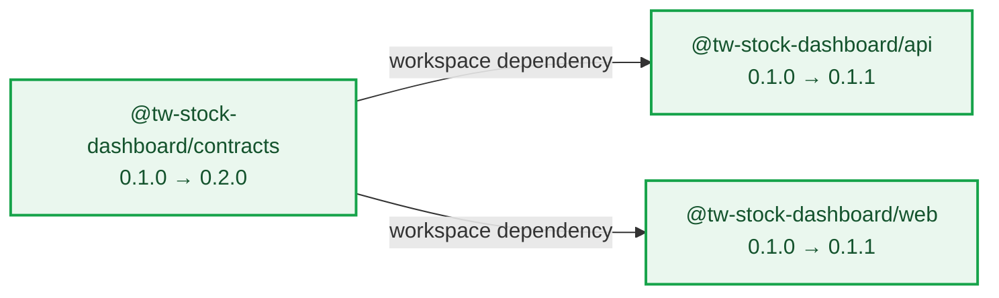
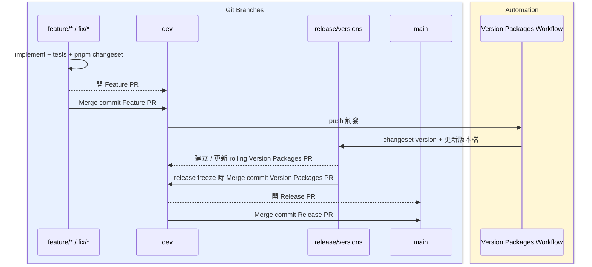

# 版本管理與 Release 流程

本專案使用 **Changesets 3** 管理各個可部署服務與共享 workspace package 的獨立 Semantic Version，同時保留既有的 `dev → main` release-controlled Git workflow。

## 一張圖看完整流程

圖中使用固定的視覺語言：藍色圓角節點代表 Git branch、紫色六角形代表 Pull Request、黃色雙框代表 GitHub workflow、綠色方框代表 release output。
Merge 與開 PR 不另外畫成節點，而是直接標示在箭頭上，避免把「物件」和「動作」混在一起。

```mermaid
flowchart LR
  FEATURE(["feature/* / fix/*"])
  FEATURE_PR{{"Feature PR"}}
  DEV(["dev<br/>整合中"])
  VERSION_PR{{"Version Packages PR"}}
  READY(["dev<br/>release-ready"])
  RELEASE_PR{{"Release PR"}}
  MAIN(["main"])
  TAG_WF[["Release Tags Workflow"]]
  TAGS["Package Git Tags"]

  FEATURE -->|"開 PR"| FEATURE_PR
  FEATURE_PR -->|"Merge commit"| DEV
  DEV -->|"自動建立 / 更新"| VERSION_PR
  VERSION_PR -->|"release freeze 時 Merge commit"| READY
  READY -->|"開 PR"| RELEASE_PR
  RELEASE_PR -->|"Merge commit"| MAIN
  MAIN --> TAG_WF
  TAG_WF --> TAGS

  classDef branch fill:#e8f1ff,stroke:#2563eb,stroke-width:2px,color:#172554
  classDef pr fill:#f3e8ff,stroke:#9333ea,stroke-width:2px,color:#581c87
  classDef workflow fill:#fff7d6,stroke:#ca8a04,stroke-width:2px,color:#713f12
  classDef output fill:#eaf7ee,stroke:#16a34a,stroke-width:2px,color:#14532d

  class FEATURE,DEV,READY,MAIN branch
  class FEATURE_PR,VERSION_PR,RELEASE_PR pr
  class TAG_WF workflow
  class TAGS output
```



## PR merge policy

所有進入 protected branch 的人工 PR 統一使用 **Merge commit**，保留 reviewed PR boundary 與真實 ancestry；PR 內部仍保留整理過、可 trace 的 logical commits。

| 流程 | Merge method | 原因 |
| --- | --- | --- |
| `feature/*` / `fix/* → dev` | Merge commit only | 保留 reviewed PR boundary，同時保留 PR 內的 logical commits |
| `release/versions → dev` | Merge commit only | 明確留下版本準備 PR 的 release boundary，便於 audit 版號與 CHANGELOG |
| `dev → main` | Merge commit only | 保留 long-running `dev` 與 production `main` 的真實 release ancestry |
| `hotfix/* → main` | Merge commit only | 清楚保留 production hotfix PR boundary 與 ancestry |
| hotfix 後 `main → dev` | workflow `git merge --no-ff` | 自動回灌完整 production history；若衝突則停止並改走 dedicated sync PR |

這個策略讓 `git log --first-parent dev` 可以直接閱讀每次 PR 進入 `dev` 的整合邊界，需要實作細節時再展開 merge commit 內的 logical commits。

AI 開發與 review 過程可以產生多個 iterative commits，但這不代表 agent 可以自行 rewrite history。只有使用者明確要求整理、重建或重新 step 某個 branch 的 commits 時，才使用全域 `branch-commit-cleanup` skill；「準備開 PR」本身不會自動觸發 cleanup。

## 哪些 workspace 有獨立版本

| Workspace | Package | 版本來源 | 代表意義 |
| --- | --- | --- | --- |
| `apps/api` | `@tw-stock-dashboard/api` | `apps/api/package.json#version` | 後端服務版本 |
| `apps/web` | `@tw-stock-dashboard/web` | `apps/web/package.json#version` | 前端應用程式版本 |
| `packages/contracts` | `@tw-stock-dashboard/contracts` | `packages/contracts/package.json#version` | 共用 TypeScript contract 版本 |

root package 刻意不設定版本號。
三個 workspace 各自維護版本，不需要保持相同版號；同一項功能變更也可以讓不同 package 分別升 patch、minor 或 major。

所有 package 仍維持 `private: true`。
Changesets 在本專案只負責版本號、CHANGELOG 與 Git tag，**不會 publish 到 npm**。

## 為什麼不只靠 commit 自動判斷版本

Conventional Commits 仍然用來描述 Git history，例如：

```text
fix(api): Correct closed-session quote freshness
feat(contracts)!: Replace quote response schema

BREAKING CHANGE: Consumers must migrate to the normalized quote fields.
```

Changesets 另外記錄「各 package 受到這次變更的版本影響」。
這在 monorepo 特別重要，因為同一項實作可能同時是：

```text
contracts  major
api        minor
web        patch
```

單一 commit 上的 `feat!` 無法表達三個 package 各自不同的 bump。
`.changeset/*.md` 可以。

## SemVer 判斷原則

版本應依 **package 本身的相容性影響** 判斷，不要只看 commit type。

- **patch**
  - 向下相容的 bug fix。
  - 修正既有行為，但不要求使用端修改程式。
- **minor**
  - 向下相容的新功能。
  - 新增 public API、contract field 或其他既有使用方式仍可繼續運作的能力。
- **major**
  - 不向下相容的 public API 或 contract 變更。
  - 使用端需要 migration 才能繼續使用。
- **不直接 bump**
  - 純文件。
  - 測試。
  - refactor。
  - 沒有 releasable behavior change 的內部修改。

如果 public contract 有 breaking change，commit 仍必須遵循全域 commit 規則，同時使用 `!` 與 `BREAKING CHANGE:` footer。
Changeset 裡的 major bump 不能取代 Git history 上的 breaking change 訊號。

## Internal dependency 自動 bump

雖然各 package 是獨立版號，但 workspace 之間仍有 dependency graph。

目前設定：

```json
"updateInternalDependencies": "patch"
```

因此，當某個 workspace dependency 發布新版本時，Changesets 可能會自動替依賴它的 package 加上一個 patch release。



本專案實際做過一組 smoke test。
三個 package 一開始都是 `0.1.0`，Changeset 只明確宣告：

```yaml
---
"@tw-stock-dashboard/api": patch
"@tw-stock-dashboard/contracts": minor
---

Verify independent private workspace versioning.
```

執行 `changeset version` 後，實際結果是：

```text
api        0.1.0 → 0.1.1
contracts  0.1.0 → 0.2.0
web        0.1.0 → 0.1.1   # automatic dependent patch
```

`web` 並不是被強制跟 `contracts` 使用相同版號。
它會升 patch，是因為產出的 Web artifact 依賴已經更新版本的 internal contracts package。

如果 dependent package 本身也有真正的 feature 或 breaking change，就應該在 Changeset 裡明確宣告更高的 bump，而不是依賴這個自動 patch。

## 一般開發流程：feature / fix → dev

一般產品開發都從 `dev` 開始。
先看 sequence diagram 可以快速分辨 branch 與實際操作：藍色區塊是 Git branches，黃色區塊是 automation；「開 PR」與「merge」分成不同訊息。



從 `dev` 開 focused branch：

```bash
git switch dev
git pull --ff-only
git switch -c feat/example
```

功能與測試完成後，如果這次修改屬於 releasable change，就建立 Changeset：

```bash
pnpm changeset
```

Changesets 會詢問：

1. 哪些 package 直接受到影響。
2. 每個 package 要升 patch、minor 或 major。

例如新增一個向下相容的 API 欄位，並透過 contracts 提供給前端使用，可能產生：

```yaml
---
"@tw-stock-dashboard/api": minor
"@tw-stock-dashboard/contracts": minor
"@tw-stock-dashboard/web": patch
---

Expose quote freshness metadata and migrate the dashboard consumer.
```

Changeset 應該和這次實作一起 commit。
**一般 feature branch 不要執行 `pnpm version:packages`。**

branch 以 Merge commit 進 `dev` 後，`Version Packages` GitHub workflow 會收集目前所有 pending Changesets，並建立或更新由 bot 管理的 PR：

```text
release/versions → dev
```

真正的版本號修改會出現在這個 PR，例如：

```text
apps/api/package.json                0.1.0 → 0.2.0
apps/api/CHANGELOG.md                updated
packages/contracts/package.json      0.1.0 → 0.2.0
packages/contracts/CHANGELOG.md      updated
apps/web/package.json                0.1.0 → 0.1.1
apps/web/CHANGELOG.md                updated
.changeset/<pending>.md              consumed/removed
```

workflow 使用官方的 `changeset version` 指令處理版本計算與檔案更新。
GitHub Actions 只負責 branch 與 PR 的自動化流程，不自行實作 SemVer 判斷。

### Version Packages PR 是 rolling release plan

Version Packages PR 的存在不代表「現在就要升版 / release」。它表示：

> 如果現在停止把新功能加入這一批 release，依目前 `dev` 上所有 pending Changesets，下一版會長這樣。

因此使用方式是：

1. `dev` 還要繼續累積同一批 release 的 feature / fix：**保持 Version Packages PR open**。
2. 新的 Changeset merge 進 `dev`：workflow 以最新 `dev` 強制重建 `release/versions`，Changesets 重新聚合所有 pending bump，並更新同一個 open PR。
3. 只有明確準備 / freeze 下一個 release candidate 時，才 review 該 PR 的 package version、CHANGELOG、internal dependency bump，並 merge 回 `dev`。
4. Version Packages PR merge 後，pending Changesets 會被 consume，實際版號與 CHANGELOG 成為 `dev` 的 release candidate 狀態。
5. release candidate 確認後，再開 `dev → main` Release PR；進 `main` 才觸發 package Git tags。

例如目前 Web 已累積 `minor`，後續同一 release 又加入 Web patch，聚合結果仍會是該 baseline 的下一個 minor；若後續加入更高級別的 bump，Version Packages PR 會依所有 pending Changesets 重新計算。

### 準備一般 Release

一般 release 流程如下：

1. 在準備 freeze release 時 review `release/versions → dev` PR。
  - 確認各 package 的版本 bump。
  - 確認自動產生的 dependent bump 是否合理。
  - 確認 CHANGELOG。
  - 確認 internal dependency 更新。
2. 將 Version Packages PR 以 **Merge commit** 進 `dev`。
3. 在 `dev` 執行既有 verification gates，確認這個已寫入版號的 release candidate。
4. 明確決定要 release 時，開啟 `dev → main` Release PR；`main` 的 commitlint、quality、E2E 與 Strict up-to-date gate 全部通過後，使用 **Merge commit** merge。
5. 如果這次 `main` 更新包含 workspace `package.json#version` 變更：
  - `Release Tags` workflow 會執行 `changeset git-tag`。
  - 只 push 這次真的有變更版本的 package tag。

Changesets 在 monorepo 中產生的 tag 格式是 package name 加 version，例如：

```text
@tw-stock-dashboard/api@0.2.0
@tw-stock-dashboard/web@0.1.1
@tw-stock-dashboard/contracts@0.2.0
```

未來可以直接使用這些 tag 驅動：

- Docker image tag。
- deployment metadata。
- generated artifact。
- GitHub Release。

不需要再另外建立一套版本來源。

## Production Hotfix：main → hotfix → main → dev

Production hotfix 會刻意繞過 `dev` 裡尚未 release 的功能。

```mermaid
flowchart LR
  MAIN_START(["main"])
  HOTFIX(["hotfix/*"])
  PREP["fix + tests<br/>Changeset + version bump"]
  HOTFIX_PR{{"Hotfix PR"}}
  MAIN_RELEASED(["main<br/>hotfix released"])
  TAG_WF[["Release Tags Workflow"]]
  TAGS["Changed Package Git Tags"]
  SYNC_WF[["Main → Dev Sync Workflow"]]
  DEV(["dev"])

  MAIN_START -->|"從 main 開 branch"| HOTFIX
  HOTFIX --> PREP
  PREP -->|"開 PR"| HOTFIX_PR
  HOTFIX_PR -->|"Merge commit"| MAIN_RELEASED
  MAIN_RELEASED --> TAG_WF
  TAG_WF --> TAGS
  MAIN_RELEASED -->|"hotfix PR merged"| SYNC_WF
  SYNC_WF -->|"quality gate · clean back-merge"| DEV

  classDef branch fill:#e8f1ff,stroke:#2563eb,stroke-width:2px,color:#172554
  classDef pr fill:#f3e8ff,stroke:#9333ea,stroke-width:2px,color:#581c87
  classDef workflow fill:#fff7d6,stroke:#ca8a04,stroke-width:2px,color:#713f12
  classDef operation fill:#ffffff,stroke:#64748b,stroke-width:1.5px,color:#0f172a
  classDef output fill:#eaf7ee,stroke:#16a34a,stroke-width:2px,color:#14532d

  class MAIN_START,HOTFIX,MAIN_RELEASED,DEV branch
  class HOTFIX_PR pr
  class TAG_WF,SYNC_WF workflow
  class PREP operation
  class TAGS output
```



從目前 production 對應的 `main` 開 branch：

```bash
git switch main
git pull --ff-only
git switch -c hotfix/closed-session-freshness
```

完成修正與驗證後，建立 hotfix Changeset：

```bash
pnpm changeset
pnpm changeset status --since main
```

與一般 feature branch 不同，hotfix PR 在進 `main` 前，就要先在 **hotfix branch** consume Changeset：

```bash
pnpm version:packages
pnpm install --lockfile-only
```

接著 review diff。

如果只是 API 本身的向下相容 bug fix，且沒有修改任何會影響其他 workspace 的 internal dependency，結果可能是：

```text
@tw-stock-dashboard/api       1.4.0 → 1.4.1
@tw-stock-dashboard/web       unchanged
@tw-stock-dashboard/contracts unchanged
```

如果 hotfix 修改了 `contracts`，Changesets 可能依 workspace dependency graph，自動替 API 或 Web consumer 加上 patch release。

確認版本結果後，將 Changesets 產生的 release files 一起 commit，再直接開 PR 到 `main`。
這個 hotfix PR 本身就必須包含最終 package version，因為一般的 Version Packages automation 刻意只對 `dev` 運作，不會替 `main` 的 hotfix 再建立第二個 version PR。hotfix PR 通過 `main` gates 後使用 **Merge commit** merge。

### Hotfix release 後一定要回灌 dev

Hotfix PR merge 進 `main` 後，`Sync Main to Dev` workflow 會自動驗證 PR 已 merge、base 是 `main`、head 是同 repository 的 `hotfix/*`，再以 repository-scoped GitHub App 執行 hard-coded `main → dev` clean back-merge。

workflow 會先在 runner 建立 merge result，執行 commitlint、lint、typecheck 與 deterministic tests；全部通過才 direct push `dev`。若 `main` 已存在於 `dev` 則 no-op；若有 merge conflict 則直接失敗，不自行解衝突。衝突必須改用 dedicated sync branch 解決並走一般 PR 到 `dev`，該 PR使用 **Merge commit**。無參數的 `workflow_dispatch` 只作為相同 `main → dev` 動作的 recovery fallback。

不要只 cherry-pick bug-fix commit。
`dev` 必須一起拿到：

- bug fix。
- 已 release 的 package version。
- CHANGELOG 狀態。
- internal dependency version 狀態。

如果 `dev` 上原本已經有其他 pending Changesets，下一次 push 到 `dev` 時，`release/versions` 會以 hotfix 更新後的版本為新 baseline 重新產生。

## 常用指令

| 指令 | 用途 |
| --- | --- |
| `pnpm changeset` | 互動式建立各 package 的 release intent |
| `pnpm changeset:status` | 以設定好的 `dev` 為基準查看 pending release plan |
| `pnpm changeset status --since main` | Hotfix 時以 `main` 為基準檢查 release plan |
| `pnpm version:packages` | Consume pending Changesets，並更新 `package.json` version 與 CHANGELOG |
| `pnpm release:tags` | 依目前 package version 建立 Changesets Git tags；CI 只 push 實際有變更的 package tag |

## GitHub 自動化

### `.github/workflows/version-packages.yml`

這個 workflow 會在 push 到 `dev` 時執行，也可以手動觸發。

主要工作：

1. 使用穩定版的 `actions/checkout@v7.0.1` 與 `pnpm/setup@v2.1.0`。
  - Node 使用 24。
  - pnpm 使用 repository 指定的 11。
2. 檢查是否有 pending `.changeset/*.md`。
3. 使用 `changeset status --verbose` 驗證 pending release plan。
4. 以最新 `dev` 重建 `release/versions`。
5. 執行 `changeset version`，並更新 lockfile。
6. 建立或更新 Version Packages PR。

`release/versions` 是由 bot 管理的 branch，而且每次都會依最新 `dev` 強制重建。
只要還有 pending Changesets，open Version Packages PR 就作為 rolling release-plan preview 持續更新；沒有 pending Changesets 時 workflow 會關閉 stale version PR。
不要在這個 branch 上放任何產品開發內容，也不要因為 PR 自動出現就自動 merge。

### `.github/workflows/release-tags.yml`

這個 workflow 只會在 `main` 執行：

- push 中包含 workspace `package.json` 時自動觸發。
- 也可以手動觸發。

workflow 會：

1. 比較這次 push 前後各 package 的 version。
2. 執行 `changeset git-tag`。
3. 只 push 實際有版本變更的 package tag。

## 為什麼沒有使用 `changesets/action`

導入這套流程時，本專案使用的是最新 stable `@changesets/cli` 3.x。
當時 stable `changesets/action` 仍停在配合 Changesets 2 的 v1 系列；支援 Changesets 3 的 v2 系列仍是 `next` prerelease。

本專案明確禁止：

- alpha。
- beta。
- RC。
- canary。
- next。

因此這裡不會：

- 為了使用 stable Action 而把 Changesets 降回舊版。
- 為了使用 Changesets 3 而導入 prerelease Action。

目前做法是在 stable Changesets CLI 外面保留一層很薄、可以直接閱讀的 GitHub Actions orchestration。
等未來有與目前 CLI 相容的 stable Changesets Action，再重新評估是否替換即可。

## 未來 Swagger / OpenAPI / codegen 的版本來源

之後加入 Swagger / OpenAPI generation 時，不要另外建立第二個 API release version。

版本來源統一使用：

```text
apps/api/package.json#version
        ↓
OpenAPI info.version
        ↓
generated spec/artifact metadata
        ↓
Docker/deployment/SigNoz service.version where appropriate
```

也就是 `apps/api/package.json#version` 作為 API service version 的 SSOT。

未來如果新增 generated SDK，它可以有自己的獨立 package version。
只有在 contracts 與 generated SDK **刻意要求完全相同版號**時，才應該把兩者放進 Changesets `fixed` group。

## 常見問題

### 功能已經修改行為，但沒有出現 Version Packages PR

先確認 feature PR 是否包含 `.changeset/*.md`，而且該 Changeset 已經進入 `dev`：

```bash
pnpm changeset:status
```

純文件、測試或沒有 releasable behavior change 的內部修改，可以刻意不建立 Changeset。

### Version Packages PR 出現後要立即 merge 嗎？

不要。只要 `dev` 還要繼續累積同一個 release 的內容，就讓 PR 保持 open。
每次新的 pending Changeset 進 `dev`，automation 都會重新產生目前的聚合 release plan。只有明確準備 / freeze release candidate 時才 merge Version Packages PR。

### Version Packages workflow 在 `changeset status` 失敗

代表 Changesets 判定目前 release plan 不一致。
常見原因是某個受到影響的 package 沒有正確宣告 release intent。

應該回到 focused branch 補上或修正 Changeset，不要直接手動修改 `package.json` version。

### Version Packages PR 出現一個我沒有選的 package

先確認它是否依賴這次要升版的其他 workspace package。
目前設定允許 Changesets 對 internal dependent 自動加入最低限度的 patch bump。

這是預期行為，而且各 package 仍然維持獨立版號。

### Hotfix 已經 merge 到 main，但 dev 還是舊版號

代表漏掉 `main → dev` 的 back-merge。
先把 `main` merge 回 `dev`，再繼續一般開發與 release 流程。

### Git tag 已經存在

不要覆寫或移動既有 release tag。
先確認 package version 與 release history。
如果版本狀態真的有問題，應該透過新的 release 修正，不要 force-move 已存在的 tag。
